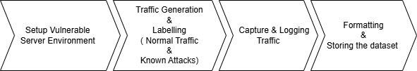
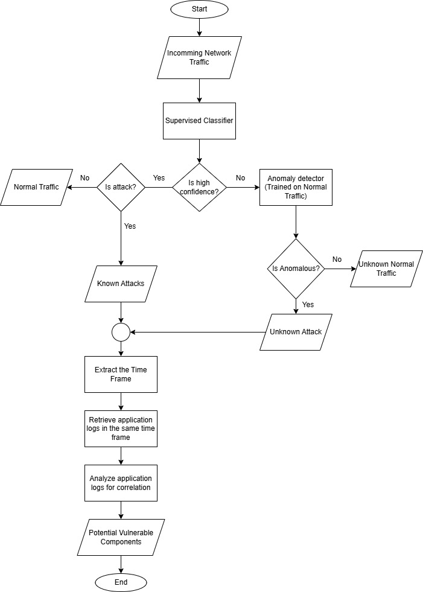

[comment]: # "This is the standard layout for the project, but you can clean this and use your own template"

# Predicting Cybersecurity Attacks Using Compound Analysis with Classification Algorithms

#### Table of content

1. [Abstract](#abstract)
2. [Introduction](#introduction)
3. [Problem Statement](#problem-statement)
4. [Aim and Objectives](#aim-and-objectives)
5. [Related works](#related-works)
6. [Methodology](#methodology)
7. [Experiment Setup and Implementation](#experiment-setup-and-implementation)
8. [Results and Analysis](#results-and-analysis)
9. [Conclusion](#conclusion)
10. [Publications](#publications)
11. [Links](#links)

---

## Abstract

The increasing sophistication of cyber threats targeting web applications poses significant challenges for traditional security mechanisms. Identifying the vulnerable components of a web application during a cyber attack is crucial for mitigating security risks and enhancing system resilience. Attackers exploit weaknesses in web applications and APIs, often bypassing conventional security defenses.

In this work, we propose a framework to detect and analyze vulnerable components by correlating system logs and access logs with identified cyber attacks. First, network traffic is classified to distinguish between normal requests and attack patterns. If an attack is detected, the corresponding application logs are retrieved based on the time interval of the attack. By analyzing these logs, we determine which application function, service, or module is susceptible to exploitation.

The framework employs a three-stage classification approach. Initially, supervised classifiers are used to identify known attack patterns. Next, an anomaly detection model, specifically a One-Class SVM, classifies previously unseen or anomalous traffic. Finally, a root cause analysis component processes application logs within the detected attack timeframe to accurately determine the vulnerable component.

Designed for seamless integration into existing security infrastructures, such as web application firewalls (WAFs) and API gateways, the proposed framework operates efficiently without disrupting normal workflows. Performance evaluation is conducted based on detection accuracy, computational efficiency, and adaptability to evolving cyber threats. This approach enhances application-layer security by providing actionable insights into vulnerable components, aiding in proactive threat mitigation during software development and deployment.

**Keywords**: Cyber Attacks, Web Application Firewalls, Compound Prediction, Neural Networks, Network Security Situation.

## Introduction

### Background
The rapid digital transformation has led to a significant increase in cyber threats, particularly at the application layer, where web applications and microservices are prime targets for attackers. Traditional Intrusion Detection Systems (IDS) and Web Application Firewalls (WAFs) primarily rely on rule-based or signature-based mechanisms to detect malicious activities. However, these approaches struggle against modern cyber threats, such as zero-day attacks and sophisticated obfuscation techniques, which bypass conventional security measures.

### Research Motivation
The motivation for this research stems from the need for an advanced intrusion detection approach that addresses the limitations of current IDS solutions. The proposed framework integrates multiple detection techniques into a structured, hierarchical architecture, enhancing scalability, accuracy, and adaptability to diverse and evolving cyber threats.

### Key Challenges Addressed
- High false positive rates in traditional IDS
- Emergence of adversarial attacks
- Lack of generalization in existing IDS models
- Complexity of application-layer attacks
- Failure to establish cross-layer correlations between security events

## Problem Statement

Modern cyber threats increasingly target the application layer of web infrastructures, exploiting vulnerabilities in web applications and APIs while bypassing traditional security measures. A major limitation of current security solutions is their inability to correlate attack indicators across multiple layers, including system logs, application logs, and network activity.

The primary objective of this research is to develop a hierarchical, multi-stage intrusion detection framework that not only detects cyberattacks but also identifies the specific vulnerable component of the application during an attack.

## Aim and Objectives

### Aim
To design, implement, and evaluate a hierarchical, multistage detection system capable of identifying both known and unknown web application attacks as well as the application component which is vulnerable during the cyber attacks with high accuracy, scalability, and adaptability, thereby enhancing overall application-layer security.

### Objectives
1. To design and develop a hierarchical, multi-stage algorithmic framework
2. To define measurable security metrics, including classification accuracy, detection precision, computational efficiency, and adaptability
3. To explore several algorithmic approaches within the hierarchical framework, combining neural networks with ensemble-based machine learning techniques
4. To design scalable algorithms capable of adapting to future application-layer attack innovations and network expansions
5. To investigate practical techniques for integrating the proposed framework into real-world application-layer security systems

## Related works

### Key Research Areas
- **Intrusion Detection Systems (IDS)**: Evolution from signature-based to ML/DL-based approaches
- **Network-Layer vs. Application-Layer Detection**: Focus on application-layer threats like SQL injection, XSS, and RCE
- **Machine Learning in Cybersecurity**: SVM, Decision Trees, Random Forests, CNN, LSTM implementations
- **Limitations of Traditional Approaches**: Static pattern sets, high false positives, lack of adaptability
- **Dataset Challenges**: Issues with outdated datasets (KDD Cup 1999, DARPA) and need for modern alternatives (NSL-KDD, CICIDS2017)

## Methodology

### Overview
Our hierarchical, multistage approach combines:
1. **Supervised Classification** for known threats
2. **Anomaly Detection** for suspicious, potentially unknown attacks
3. **Root Cause Analysis** for identifying the specific vulnerable application component using log correlation

### Data Collection

1. **Setup Vulnerable Server Environment**
   - Deploy intentionally vulnerable web applications (DVWA, OWASP Juice Shop, WebGoat)
   - Host on virtual machines or Docker containers
   - Install logging/monitoring tools

2. **Traffic Generation and Labelling**
   - Normal traffic: Selenium, JMeter, or Locust for user behavior simulation
   - Attack traffic: OWASP ZAP, Burp Suite for known vulnerabilities
   - Custom scripts for additional malicious payloads

3. **Log Collection and Correlation**
   - Web application logs using security tools
   - Database logs (MySQL, MongoDB, PostgreSQL)
   - Centralized logging with ELK Stack or Splunk

### Model Development
1. **Supervised Classifier**: Logistic Regression, Random Forest, Gradient Boosting, or Neural Networks
2. **Anomaly Detector**: One-Class SVM, Isolation Forest, or Autoencoder-based approaches
3. **Vulnerability Identification Component**: Correlation analysis to identify vulnerable components

### Detection Pipeline

The hierarchical detection pipeline includes:
- Feature extraction
- Classifier decision stage
- Anomaly detection stage
- Root cause analysis through log correlation
- Feedback loop for continuous improvement

## Experiment Setup and Implementation

### Environment Setup
- Vulnerable applications deployed in controlled environments
- Docker containers for isolation
- Custom log collection scripts

### Evaluation Metrics
- **Performance Metrics**: Accuracy, Precision, Recall, F1-score, FPR, FNR
- **Root Cause Accuracy**: Correctness in identifying affected components
- **Scalability Performance**: Ability to handle large traffic volumes

### Experimental Scenarios
1. Known attacks evaluation
2. Unknown or mutated attacks testing
3. Unknown normal cases assessment
4. Adaptive attack resistance testing

## Results and Analysis

*[To be updated as the project progresses]*

## Conclusion

This research proposes a hierarchical, multistage intrusion detection framework focused on application-layer threats. By combining supervised classification for known malicious patterns with anomaly detection for novel exploits, the proposed system aims to improve:

- **Accuracy**: Through targeted use of ML/DL models
- **Scalability**: Via efficient algorithms and containerized environments
- **Adaptability**: Through feedback loops and continuous learning
- **Component Identification**: By pinpointing affected microservices or functions

The framework integrates seamlessly into existing WAFs and API gateways, minimizing overhead while maximizing security benefits for web applications and APIs.

## Publications
[//]: # "Note: Uncomment each once you uploaded the files to the repository"

<!-- 1. [Semester 7 report](./) -->
<!-- 2. [Semester 7 slides](./) -->
<!-- 3. [Semester 8 report](./) -->
<!-- 4. [Semester 8 slides](./) -->
<!-- 5. Author 1, Author 2 and Author 3 "Research paper title" (2021). [PDF](./). -->

## Timeline

Key milestones include:
- Literature Review & Proposal (Jan 2025)
- Environment Setup & Data Collection (Feb-Mar 2025)
- Model Development & Training (Mar-May 2025)
- Evaluation & Testing (May-Jun 2025)
- Final Report & Presentation (Jul 2025)

#### Team

- E/19/060, Danujan S., [email](mailto:e19060@eng.pdn.ac.lk)
- E/19/134, Harnan M., [email](mailto:e19134@eng.pdn.ac.lk)
- E/19/266, Nithusikan T., [email](mailto:e19266@eng.pdn.ac.lk)

#### Supervisors

- Mr. Biswajith Dissanayake, [email](mailto:biswajithd@eng.pdn.ac.lk)
- Janith Malinga (Amazon UK), [email](mailto:name@eng.pdn.ac.lk)

## Links

[//]: # ( NOTE: EDIT THIS LINKS WITH YOUR REPO DETAILS )

- [Project Repository](https://github.com/cepdnaclk/e19-4yp-The-Compound-Prediction-Analysis-of-Cybersecurity)
- [Project Page](https://cepdnaclk.github.io/e19-4yp-The-Compound-Prediction-Analysis-of-Cybersecurity)
- [Department of Computer Engineering](http://www.ce.pdn.ac.lk/)
- [University of Peradeniya](https://eng.pdn.ac.lk/)

[//]: # "Please refer this to learn more about Markdown syntax"
[//]: # "https://github.com/adam-p/markdown-here/wiki/Markdown-Cheatsheet"
